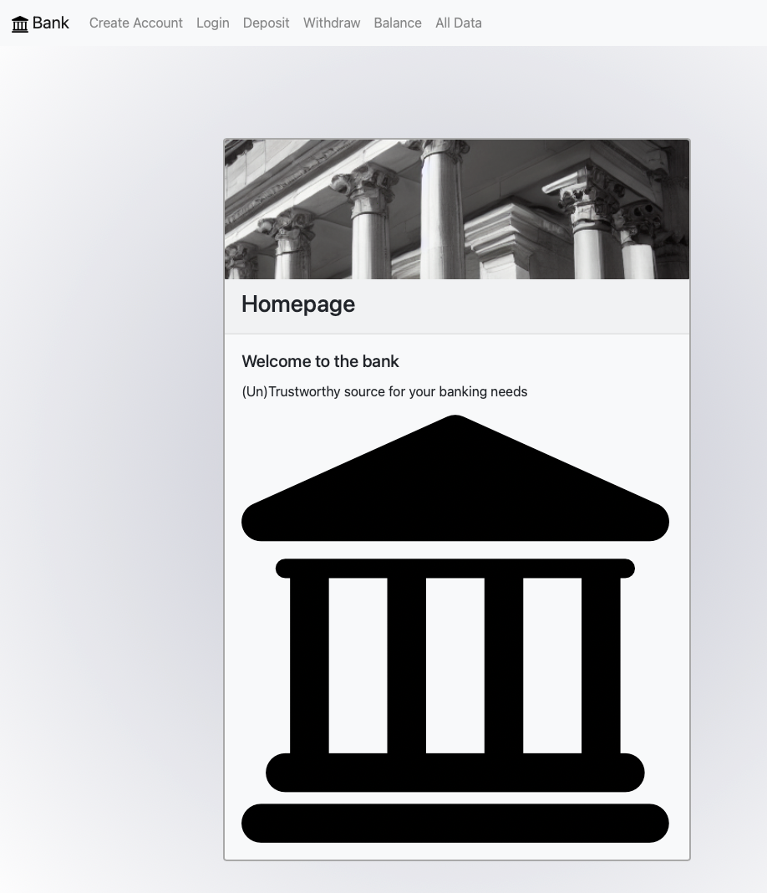

# Three Tiered Banking Application


## About 
This banking application is the final Capstone project for the MIT web development certification. The purpose is to display the author's skills in creating a three-tiered application that includes authentication and a database. This app in particular includes a navigation bar that allows a user to create an account, login, deposit, withdraw, and view their balance. The balance is updated on the form as well as in the database that all user information is stored in.

### Built With
- React
- Node.js
- Bootstrap
- Firebase Authentication
- MongoDB
- Docker

## Getting Started
1. Install npm

```npm install npm@latest```

2. Clone the repo

```git clone https://github.com/djgillespie/banking-app.git```

3. Install npm packages

```npm install```

4. Run node server

```node index.js```

5. Navigate to [http://localhost:3000/](http://localhost:3000/)

## Usage
Create Account - new users can create an account

Login - returning users can log into their account along with new users after registration

Deposit/Withdraw - users can make a deposit or withdrawal

Balance - users can view their current balance

## License
Distributed under the MIT license.

## Contact
Diane Gillespie - [LinkedIn](https://www.linkedin.com/in/dianejgillespie/)

Project Link - [https://github.com/djgillespie/banking-app.git](https://github.com/djgillespie/banking-app.git)